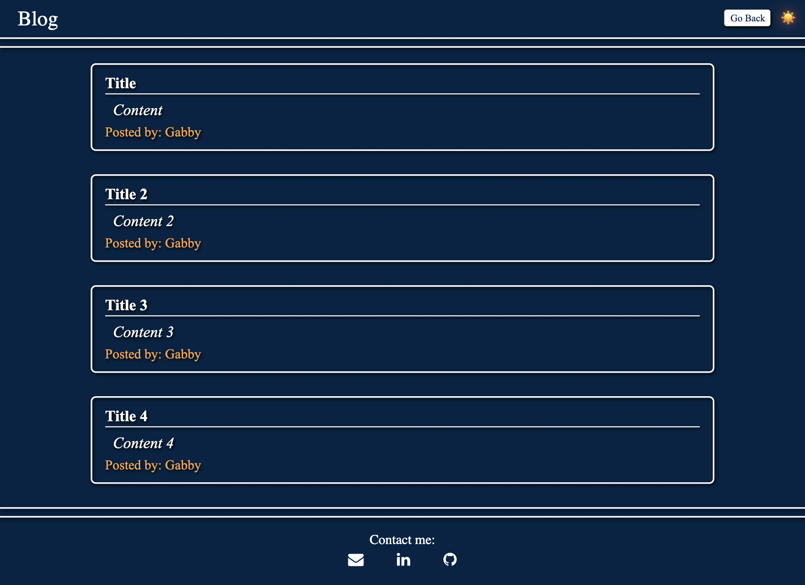
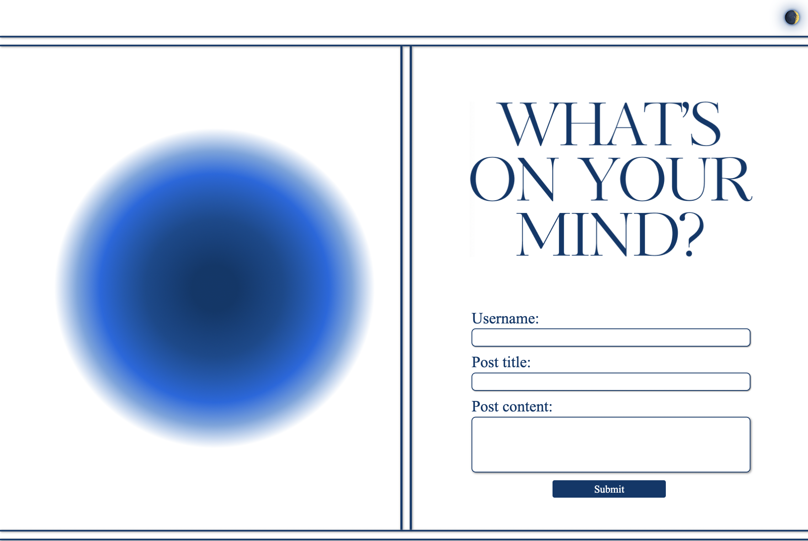

# Personal Blog

## Description

Visit this site at https://gcbel.github.io/cu-blog/.

In this project, I aimed to create a personal blog based on this reference provided by the Columbia University Full-Stack Bootcamp.

For this project, I created a page that allows users to store personal blog posts that will persist between page isits. To do this, the page locally stores a user's blog information, including usernames, post titles, and post content. Through this project, I had the opportunity to practice using vanilla Javascript, CSS, and flexbox to create a responsive webpage that dynamically resizes into mobile and desktop layouts.

The final deployed desktop webpage in dark mode:

In light mode:

## Installation

N/A

## Usage

Webpage can be viewed in any browser. The first page allows users to input a username, blog title, and content for their blog. Content will be stored locally. If data is incorrectly input, the user will be prompted to complete their information.

Upon submitting a post, the webpage takes the user to their posts, which are retrieved from local storage. The "Go Back" button allows the user to navigate back to the main page.

The webpage features a light/dark toggle button, which changes the color scheme of the page. The default light/dark mode is selected based on the user's default browser preferences.

## Credits

CSS Reset (reset.css) file: https://meyerweb.com/eric/tools/css/reset/  
Lines 45-51 on logic.js were suggested to me by my wonderful TA, Max Ohsawa.

## License

Please refer to the license in the repo.
